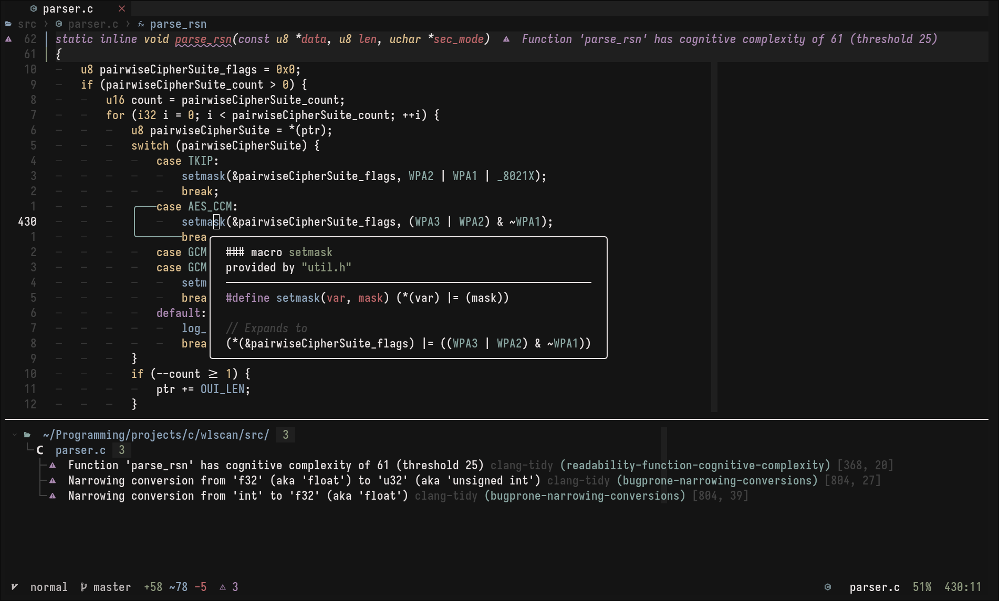
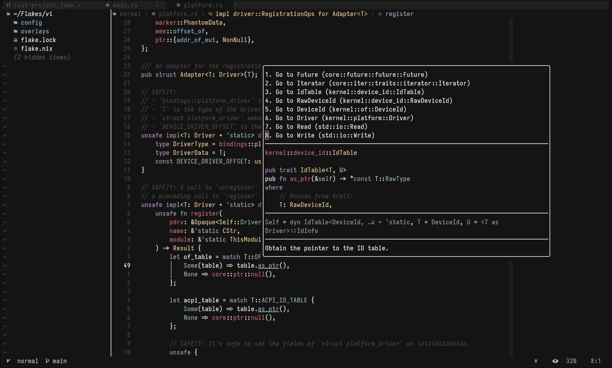
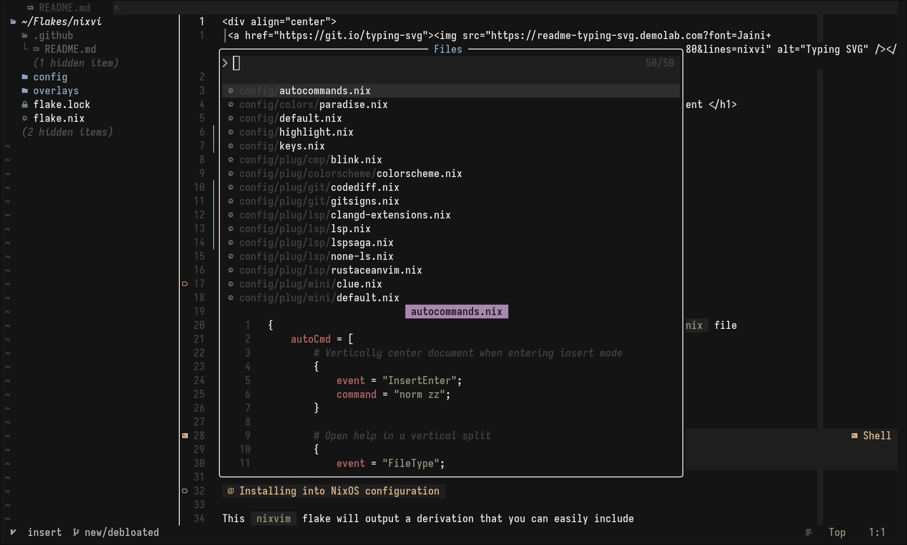
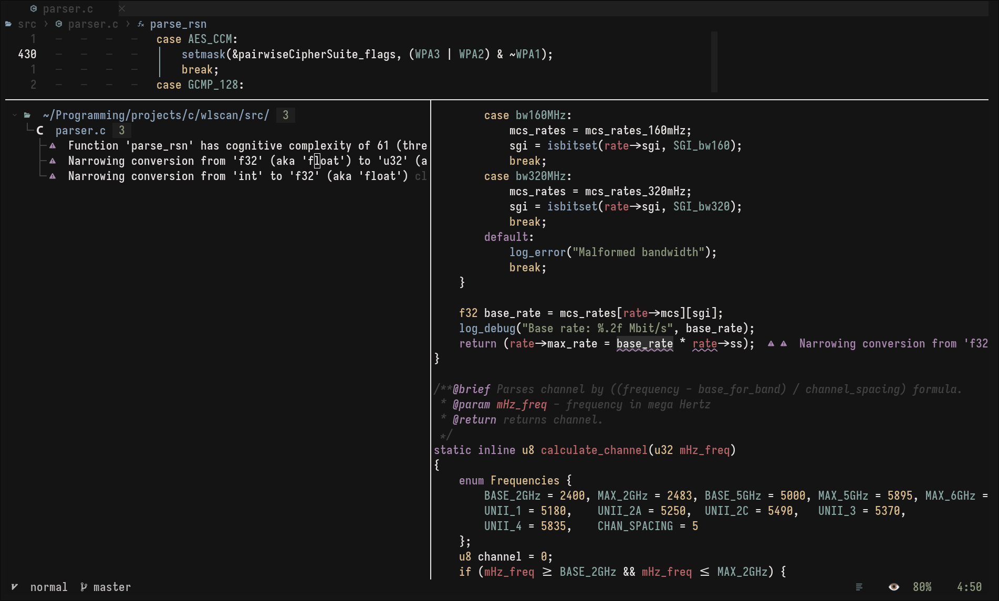
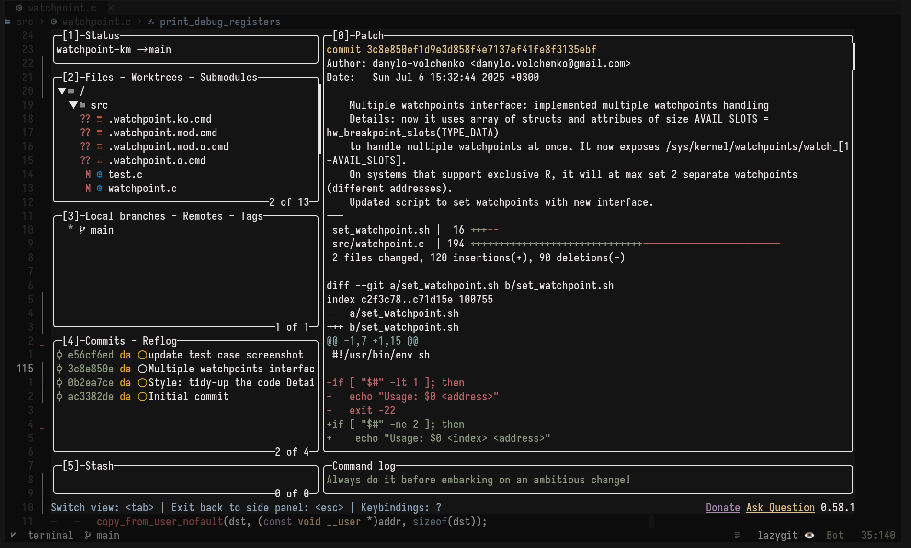
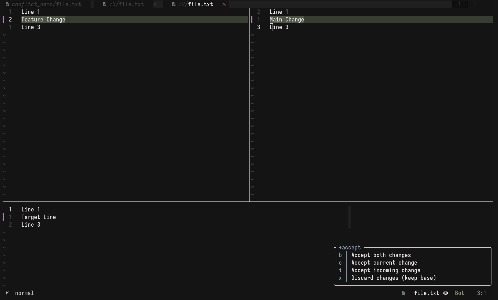
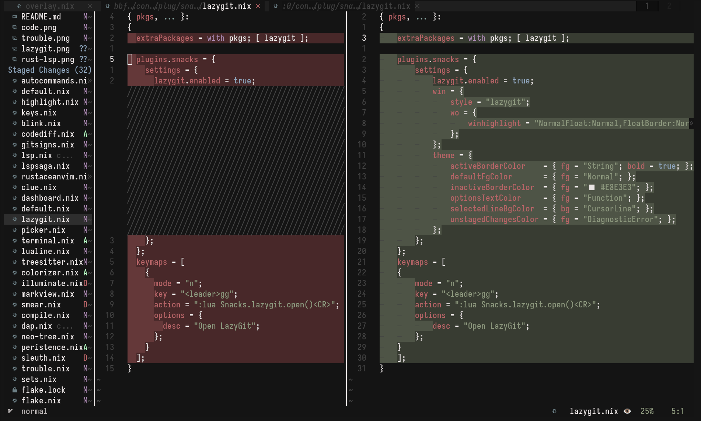

<div align="center">
 <a href="https://git.io/typing-svg"></a>
</div>

<h1 align="center"> nixvim-based neovim configuration <br> focused on C and Rust development </h1>




<details>
    <summary><h3>More screenshots</h3></summary>
    <br>
    
    
    
    
    
    
    
</details>

## Configuring

To start configuring, just add or modify the nix files in `./config`.
If you add a new configuration file, remember to add it to the [`config/default.nix`](../config/default.nix) file

### Current plugins
LSP (C/Rust focused)
-  blink.cmp: A high-performance completion engine (modern alternative to nvim-cmp).
-  lspconfig: The standard interface for connecting to Language Servers.
-  lspsaga.nvim: A UI layer for LSP providing breadcrumbs, floating windows, and hover actions.
-  clangd-extensions.nvim: Enhances the C/C++ development experience with inlay hints and better type info.
-  rustaceanvim: A heavy-duty plugin for Rust development, including advanced rust-analyzer integration.
-  none-ls.nvim: Bridges the gap for formatters and linters that don't have a standalone LSP (successor to null-ls).

UI
-    lualine.nvim: A fast and customizable statusline.
-    bufferline.nvim: Adds a tab-like bar at the top for managing open buffers.
-    noice.nvim: Overhauls the command line, messages, and notification UI.
-    markview.nvim: A modern Markdown previewer that renders directly in the buffer.
-    nvim-ufo: High-performance code folding with better visual indicators.
-    nvim-colorizer.lua: Highlighting of HEX/RGB color codes directly in your code.
-    nvim-web-devicons: Provides file type icons used by many other plugins.

Treesitter (Syntax)
-    nvim-treesitter: The core engine for advanced syntax highlighting and code parsing.
-    treesitter-context: Shows the current function/class context at the top of the screen while scrolling.
-    treesitter-textobjects: Adds smart selection based on code structure (e.g., select an entire function).

Git Integration
-    gitsigns.nvim: Shows git diffs in the sign column and allows hunk management.
-    codediff.nvim: Provides a dedicated interface for viewing and managing code diffs, merges.

Utility & Navigation
-    neo-tree.nvim: Sidebar-based file explorer.
-    trouble.nvim: A pretty list for showing LSP diagnostics, references, and search results.
-    smart-splits.nvim: Directional navigation between Neovim splits.
-    undotree: Visualizes the undo history tree, allowing you to go back to previous states.
-    todo-comments.nvim: Highlights and searches for tags like TODO, FIXME, or NOTE.
-    persistence.nvim: Automatically saves and restores your sessions. -- not configured properly yet
-    comment.nvim: Simple and powerful keybindings for commenting out code.
-    nvim-autopairs: Automatically closes brackets, quotes, and parentheses.
-    lz-n: A plugin for lazy-loading your configuration to speed up startup time.

Debugging (DAP)
-    nvim-dap: The Debug Adapter Protocol implementation for nvim.
-    nvim-dap-ui: Provides IDE-like interface for debugger (variables, stack trace, etc.).
-    nvim-dap-virtual-text: Displays variable values as virtual text next to the code during debugging.

Ecosystem Suites
-    snacks.nvim: A collection of small plugins (dashboard, picker, etc.).
-    mini.nvim: A collection of small plugins (keymap hints, etc.)


## custom QoL keymaps:
Development & LSP Utilities
-    `<leader>cv (ShowConversions)`: Opens a floating window showing the selected text/word in Hex, Binary, Decimal, and Base64. You can copy directly from this window.
-    `<leader>cl (CopyCursorLocation)`: Generates a "permalink" (relative path + line number) from the Git root and copies it to the system clipboard.
-    `<leader>ci (toggleInlayHints)`: Toggles LSP inlay hints on/off with a notification.
-    `<leader>ch (ToggleHex)`: Toggles the current buffer between raw text and Hex representation using xxd.
-    `gx (OpenUnderCursor)`: Opens the URL or file path under the cursor using xdg-open.
-    `<leader>ct (searchTag)`: Jumps to the definition of the word under the cursor using the tags file.

UI & Toggle Controls
-   `<leader>uv (Toggle Virtual Text)`: Toggles diagnostic virtual text (inline LSP diagnostics) while preserving your custom icon/prefix settings.
-   `<leader>ul (ToggleLineNumber)`: Switches between showing standard line numbers and hiding them.
-   `<leader>uL (ToggleRelativeLineNumber)`: Switches between relative line numbers and standard numbers.
-   `<leader>uw (ToggleWrap)`: Toggles line wrapping for the current buffer.
-   `<leader>cz (Zen Mode Lite)`: Simulates a "Zen" mode by toggling a large foldcolumn to center the text.

Movement & Editing
-   `J / K (Visual Mode)`: Moves the selected block of code up or down while maintaining indentation and selection.
-   `J (Normal Mode)`: Joins the line below to the current line but keeps the cursor at its original position.
-   `<C-d> / <C-u>`: Scrolls page down or up while keeping the cursor centered on the screen.
-   `<leader>fy`:  Gathers every match of the current search pattern into the system clipboard.

__If you have nix installed, you can directly run my config from anywhere:__

```shell
nix run 'github:danylo-volchenko/nixvi'
```

## Installing into NixOS configuration

This `nixvim` flake will output a derivation that you can easily include
in either `home.packages` for `home-manager`, or
`environment.systemPackages` for `NixOS`. Or whatever happens with darwin?

You can add my `nixvim` configuration as an input to your `NixOS` configuration like:

```nix
{
 inputs = {
    nixvim.url = "github:danylo-volchenko/nixvi";
 };
}
```

### Direct installation

With the input added you can reference it directly.

```nix
{ inputs, system, ... }:
{
  # NixOS
  environment.systemPackages = [ inputs.nixvim.packages.${pkgs.system}.default ];
  # home-manager
  home.packages = [ inputs.nixvim.packages.${pkgs.system}.default ];
}
```

The binary built by `nixvim` is already named as `nvim` so you can call it just
like you normally would.

### Installing as an overlay

Another method is to overlay your custom build over `neovim` from `nixpkgs`.

This method is less straight-forward but allows you to install `neovim` like
you normally would. With this method you would just install `neovim` in your
configuration (`home.packges = with pkgs; [ neovim ]`), but you replace
`neovim` in `pkgs` with your derivation from `nixvim`.

```nix
{
  pkgs = import inputs.nixpkgs {
    overlays = [
      (final: prev: {
        neovim = inputs.nixvim.packages.${pkgs.system}.default;
      })
    ];
  }
}
```
